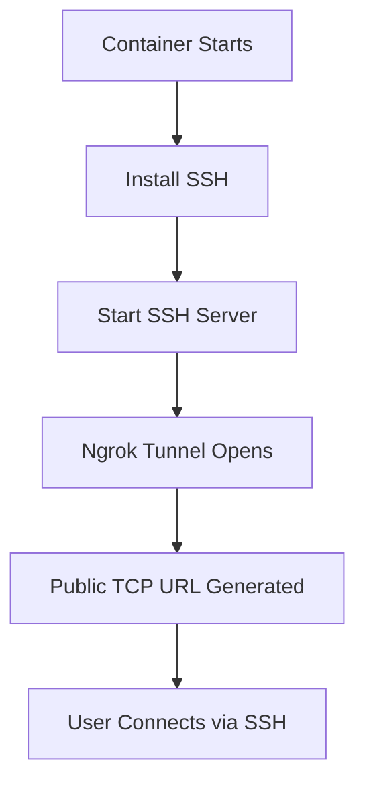

<!-- 🌌 ULTRA MODERN ANIMATED BANNER -->

<p align="center">
  
</p>

<p align="center">
  
  
  
  
  
  
</p>


---

# ⚡ NGROK SSH REMOTE CONTAINER

> 🌐 Instantly turn a Docker container into a **public remote server**
> 🚀 Access it from anywhere using SSH via Ngrok
> 🧠 Built for speed, simplicity, and experimentation

---

## 👨‍💻 Developer

* **Dev:** Notookk
* **GitHub:** https://github.com/Notookk

---

## 🧬 Project Overview

This project creates a **cloud-accessible Linux environment** using:

* 🐳 Docker container
* 🐧 Ubuntu base system
* 🌐 Ngrok TCP tunnel
* 🚂 Railway deployment

### 🔥 What happens internally:



---

## ✨ Features

* 🌍 Public SSH access from anywhere
* ⚡ Ultra-fast deployment
* 🔐 Custom login credentials
* 🧩 Lightweight container
* 🚀 Railway ready
* 💻 Works on any device

---

## 🔑 Login Credentials

```bash
Username: morning
Password: morning123
```

---

## 🚀 Deployment (Railway)

### 1️⃣ Create Project

👉 https://railway.app

* New Project → Deploy from GitHub

---

### 2️⃣ Add Environment Variable

```env
NGROK_TOKEN=your_ngrok_token_here
```

🔗 Get token: https://dashboard.ngrok.com/get-started/your-authtoken

---

### 3️⃣ Deploy & Run

* Open logs after deployment
* Find ngrok TCP address

```bash
tcp://0.tcp.ngrok.io:XXXXX
```

---

## 🔗 SSH Connection

```bash
ssh morning@0.tcp.ngrok.io -p XXXXX
```

## 📦 Tech Stack

* 🐧 Ubuntu
* 🐳 Docker
* 🌐 Ngrok
* 🚂 Railway

---

## ⚠️ Security Notice

> 🚨 This setup is designed for testing and educational purposes only


## 💡 Use Cases

* 🧪 Testing environments
* 🤖 Bot hosting
* 🖥️ Remote access lab
* ⚙️ DevOps experiments
* 🎓 Learning containers

## 🖥️ Example Session

```bash
$ ssh morning@0.tcp.ngrok.io -p 12345

Welcome to Ubuntu

morning@container:~$
```

---

## 🌌 Visual Concept

```
[ Your PC ]
     ↓ SSH
[ Ngrok Tunnel ]
     ↓
[ Railway Container ]
     ↓
[ Ubuntu + SSH Server ]
```

---

## ⭐ Support

If you like this project:

* ⭐ Star this repo
* 🍴 Fork it
* 🚀 Share it

---

## 🧬 Credits

Made with ⚡ by **Notookk**

---

<p align="center">
  
</p>
